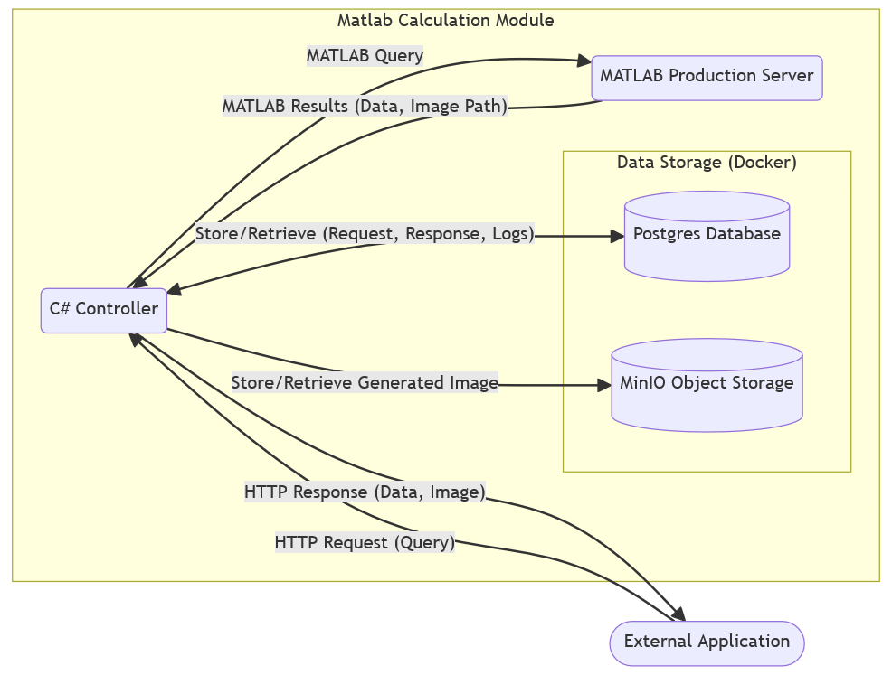

# MinIO Integration for Heatmap Image Storage

# 1. Summary

This document details the integration of MinIO, an S3-compatible object storage solution, into the MATLAB Production Server API wrapper project. MinIO serves as the primary storage for heatmap images generated by MATLAB calculations. This document outlines the configuration, implementation details and benefits of using MinIO in this context.

# 2. Introduction

## 2.1 Background

Heatmap images generated by the MATLAB production server play a crucial role in visualizing complex datasets and patterns within the analysed data. In this project, heatmaps provide a visual representation of the calculated results, offering valuable insights to users. The ability to store and retrieve these images efficiently is essential for both analysis and reporting purposes.

Traditionally, storing images directly within the application's file system or database can lead to scalability and performance bottlenecks as the volume of data grows. To address this, MinIO, a high-performance object storage solution compatible with Amazon S3, was selected to provide a dedicated and scalable storage layer for heatmap images.

MinIO's S3 compatibility allows for easy integration with the existing C# API wrapper, ensuring a streamlined workflow for image management. Additionally, its distributed architecture and focus on performance align well with the project's goals of providing a robust and efficient image storage solution.

## 2.2 Objectives

- Implement a reliable and scalable solution for storing heatmap images.
- Leverage MinIO's S3 compatibility for seamless integration with the existing API wrapper.
- Ensure secure and efficient access to stored images.

# 3. Methodology

## 3.1 Architecture



## 3.2 Technologies

- **MinIO:** S3-compatible object storage server.
- **C#:** Programming language used for the API wrapper's interaction with MinIO.
- **Minio SDK for .NET:** Library facilitating communication between the C# API and MinIO.
- **Docker:** Containerization platform for deploying MinIO.

## 3.3 Configuration

### 3.3.1 Deployment and Orchestration

MinIO is deployed as a container within a Docker Compose environment. The `docker-compose.yml` file orchestrates the deployment of the entire system, including the MATLAB algorithm, API wrapper, RabbitMQ, PostgreSQL database, and MinIO.

The relevant section in `docker-compose.yml` for MinIO is:

```yaml
minio:
image: bitnami/minio
container_name: minio
ports:
    - "9000:9000"  # API access
    - "9001:9001"  # Console access
volumes:
    - $DATA_DIR/minio:/data # Persistent storage
restart: always
networks:
    - matlab-network
```

### 3.3.2 Environment Variables (`.env`)

The configuration of MinIO relies on environment variables defined in the `.env` file. These variables are used to set up credentials, access ports, and storage locations:

- `DATA_DIR`: Defines the base directory where MinIO data is stored.
- `MINIO_USER`: Specifies the username for accessing the MinIO console and API.
- `MINIO_PASSWORD`: Sets the password for MinIO access.

### 3.3.3 Key Configuration Details

- **Image:** The `bitnami/minio` image is used, providing a pre-configured MinIO server.
- **Container Name:** The container is explicitly named `minio` for easy identification.
- **Ports:**
    - 9000: The default port for MinIO's API.
    - 9001: The port for accessing the MinIO browser console.
- **Volumes:** Data is stored persistently in the `$DATA_DIR/minio` directory, which is mapped to the `/data` directory inside the container.
- **Restart Policy:** The `restart: always` policy ensures that the MinIO container automatically restarts if it fails.
- **Networking:** The `matlab-network` bridge network enables communication between all containers in the Docker Compose setup.

### 3.3.4 Accessing MinIO

- **API:** The MinIO API can be accessed at `http://localhost:9000`.
- **Console:** The MinIO browser console is accessible at `http://localhost:9001`, using the credentials defined in the `.env` file.

### 3.3.5 Security Considerations

- **Credentials:** It's crucial to store the MinIO credentials (`MINIO_USER` and `MINIO_PASSWORD`) securely, as they provide full access to the stored data.
- **Network Isolation:** The `matlab-network` bridge network helps isolate communication between the containers, but additional security measures may be necessary depending on the deployment environment.
- **Encryption:** MinIO supports server-side encryption for data at rest. Consider enabling this feature for enhanced security if sensitive data is being stored.

## 3.4 Implementation Details

### 3.4.1 Image Upload

The C# API wrapper handles the upload of heatmap images generated by the MATLAB server to the MinIO storage. The process involves the following steps:

1. **MATLAB Server Generates Image:** After completing a calculation, the MATLAB server saves the generated heatmap image to a designated directory (`/home/appuser/data` in the Docker Compose configuration) within the container. This directory is shared with the API wrapper container via a Docker volume.
    
2. **API Wrapper Retrieves Image:** The API wrapper accesses the generated image file from the shared directory.
    
3. **MinIO Client Initialization:** The wrapper establishes a connection to the MinIO server using the provided credentials (`MINIO_USER`, `MINIO_PASSWORD`) and endpoint (`http://minio:9000`).
    
4. **Bucket Check and Creation:** The wrapper checks if a bucket named "teamiummm" exists. If not, it creates the bucket to store the heatmap images.
    
5. **Image Upload:** The wrapper uses the MinIO client's `PutObjectAsync` method to upload the image to the "teamiummm" bucket. The image is uploaded with its original filename and content type (e.g., "image/png").

**Code snippet:**
```csharp
// 'minioClient' is a configured MinIO client instance

var objectName = imageFileInfo.Name;

var putObjectArgs = new PutObjectArgs()
    .WithBucket("teamiummm")
    .WithObject(objectName)
    .WithFileName(imagePath)
    .WithObjectSize(imageFileInfo.Length)
    .WithContentType(MimeTypes.GetMimeType(imageFileInfo.Extension));

await minioClient.PutObjectAsync(putObjectArgs);

```

### 3.4.2 Image Retrieval

The API wrapper provides endpoints for retrieving heatmap images from MinIO. The process generally involves:

1. **Client Request:** The client sends a request to the appropriate API endpoint (`/getimageMinio`), providing the object name (filename) of the desired image.
    
2. **MinIO Client Retrieval:** The wrapper uses the MinIO client's `GetObjectAsync` method to fetch the image data from the specified bucket and object name.
    
3. **Response:** The wrapper returns the image data to the client, typically with the appropriate content type (e.g., "image/png") for direct display in a browser or further processing.

**Code snippet:**
```csharp
// 'minioClient' is a configured MinIO client instance

var getObjectArgs = new GetObjectArgs()
    .WithBucket("teamiummm")
    .WithObject(objectName)
    .WithCallbackStream((stream) => { /* ... stream handling logic ... */ });

await minioClient.GetObjectAsync(getObjectArgs);

```

### 3.4.3 Error Handling

The API wrapper includes error handling mechanisms to address potential issues during image upload and retrieval:

- **MinIO Errors:** Exceptions like `MinioException` are caught, logged, and translated into appropriate HTTP error responses (e.g., 500 Internal Server Error) with descriptive error messages.
- **File Errors:** Issues like missing files or incorrect file paths are handled with appropriate error responses (e.g., 404 Not Found).
- **Other Errors:** General exceptions are also caught and logged, and generic error responses are returned to the client, preventing the application from crashing.

## 4. Results & Insights

### Key Benefits

- **Scalability:** MinIO's distributed architecture allows for seamless scaling of storage capacity to accommodate growing image data.
- **S3 Compatibility:** The use of S3 APIs ensures easy integration with a wide range of tools and libraries, offering flexibility for future development.
- **Performance:** MinIO's optimized design enables fast image uploads and downloads, contributing to overall application responsiveness.
- **Data Durability:** MinIO's replication and erasure coding mechanisms provide robust protection against data loss, ensuring the safety of stored heatmaps.

## 5. Conclusion

Integrating MinIO into the MATLAB Production Server API wrapper project has proven to be a highly successful approach for managing heatmap image storage. It offers a scalable, reliable, and efficient solution that seamlessly aligns with the project's overall architecture and goals. The S3 compatibility of MinIO not only simplifies integration but also opens up possibilities for future enhancements and extensions.


-----
Last Modified: `=dateformat(this.file.mtime, "DDDD, HH:mm")`

#### Tags:

`=this.file.tags`

```dataview
List FROM #project_teamium 
```
