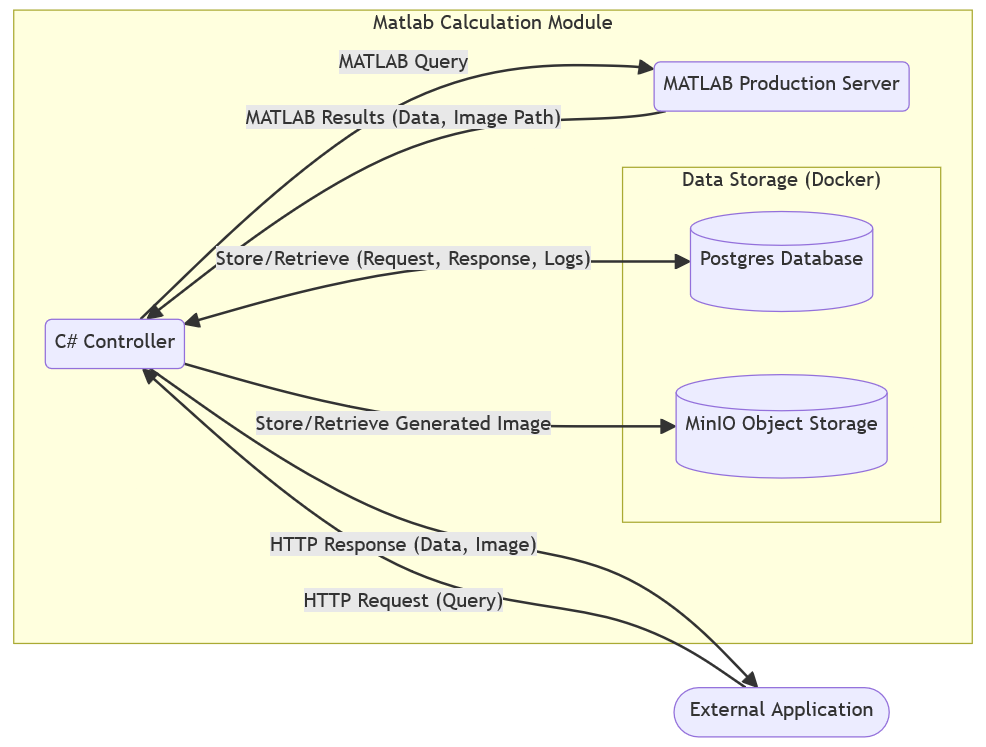

# Template for Fontys Reports for Obsidian

## 1. Put `pandoc-markdown` somewhere recognizable by your `PATH` like `/usr/local/bin`

## 2. Put [fontys logo](fontys-logo.pdf) and [background](background6.pdf) in your Obsidian Vault, in my case relative path is `Bins/Pandoc-extras` for the logo and `Bins/Pandoc-extras/background` for the background

## 2. Install [Shell commands plugin](obsidian://show-plugin?id=obsidian-shellcommands)

## 3. Add new shell command and put this in `pandoc-markdown {{file_path:relative}}`

## 4. Add a hotkey for it (Optional)

`Go to Obsidian Settings -> Hotkeys -> `


## 5. There are some fields that need to be present in the frontmatter of a file that you want to convert

```yaml
---
author: Tomasz Olejarczuk
title: Kubernetes Cluster Deployment Proposal
date: 24-02-2025
subject: Kubernetes with Cillium
titlepage: true
titlepage-text-color: "663366"
titlepage-rule-color: "663366"
titlepage-background: 
titlepage-rule-height: 
page-background: Bins/Pandoc-extras/backgrounds/background6.pdf
titlepage-logo: Bins/Pandoc-extras/fontys-logo.pdf
logo-width: 50mm
toc: true
toc-own-page: true
header-left: \hspace{1cm}
header-center: \leftmark
header-right: Page \thepage
footer-left: \thetitle
footer-center: 
footer-right: \theauthor
---
```

## 6. All of my reports have the following structure

```md
# Report layout

# 1. Summary

Include a summary that provides a brief overview of the problem, method, results, and conclusion.

# 2. Introduction

Introduce the context and background and describe the problem, question, or challenge.
   
# 3. Methodology

Explain the approach and methods used to solve the problem/question/challenge.
   
# 4. Results

Present the results obtained from your approach. This is the most extensive part of your report.
   
# 5. Insights and Conclusion

Discuss the quality of the results and how you validated them. Draw conclusions based on your findings.
   
# 6. Recommendations

Outline the next steps to be taken based on your results.
```

## 7. Tips

- Mind the headers (pandoc handles up to H4 or something) so take a look at the formatting of my [example file](example_file.md), you can see the output file [here](example_file.pdf)

- when you want to put an image in use this syntax

```md

```

- the report structure is based on [this](https://welgeen.nl/doc/)